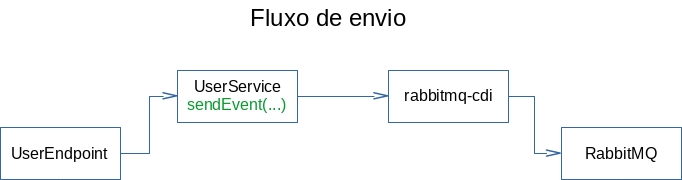
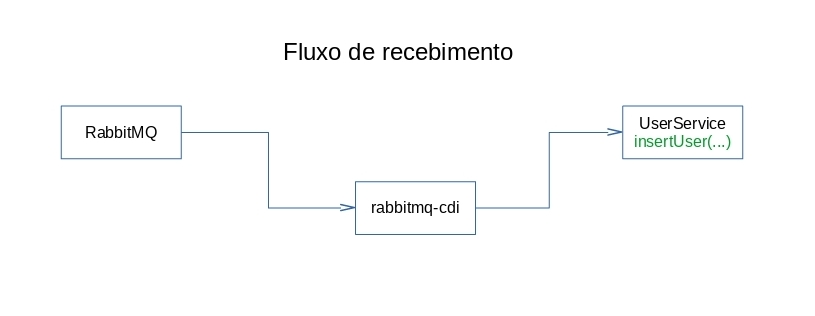

# RabbitMQ - Demo app

## Intro

Esta aplicação serve de referência para uso de processamento assíncrono no Sistema FIEG.

O processamento é realizado através de eventos (Java EE CDI), sendo que o servidor RabbitMQ é o servidor que irá gerenciar as filas. Cada mensagem da fila contém um evento que será registrado via `SendEvent` e processado pelo `ReceiveEvent`.


## Visão geral

### Propósito

O propósito desta aplicação é receber uma requisição REST (POST) com dados de usuário e simular um processamento da requisição. 

### Configuração

* Classe `s.r.r.config.RabbitBinder` - Nesta classe são  realizadas as associações (bind) de eventos com o CDI. O `SendEvent` será atrelado a uma Exchange enquanto o `ReceiveEvent` será atrelada a uma queue. Ver mais em: https://www.rabbitmq.com/tutorials/amqp-concepts.html#exchanges
* Classe  `s.r.r.config.BindingInitializer` - Nesta classe são feitas as configurações e associação do `RabbitBinder` à conexão com o servidor de mensageria(RabbitMQ)
* Classe `s.r.r.user.User` - Classe que representa um usuário de um sistema ordinário
* Classes `s.r.r.event.ReceiveEvent s.r.r.event.SendEvent` - Classes que representam as mensagem que são recebidas e enviadas via servidor RabbitMQ
* Classe - `s.r.r.user.UserEndpoint` - Classe que representa o endpoint REST que receberá o POST para processamento de usuários
* Classe - `s.r.r.user.UserService` - Classe que representa o motor de negócios suas funções são:
    * Enviar mensagens, recebidas do endpoint,  para o servidor RabbitMQ através do método `sendEvent`
    * Receber mensagens e, recebidas do servidor RabbitMQ, processá-las. Neste caso há uma simulação de processamento.
* Arquivo `src/main/resources/project-defaults.yml` - Arquivo de configuração do projeto. Nele estão contidas as System Properties do projeto. 
    * **OBS**: Atentar para as properties `rabbitdemo.rabbitmq.*`. Estas estão lendo configurações setadas nas variáveis de ambiente da estação de trabalho


### Eventos

A atual implementação é baseada em eventos sendo os fluxos:


* Envio


* Recebimento


É importante ressaltar que, neste exemplo, o processamento é assíncrono sendo 1 mensagem processada por vez. Caso seja necessário implementar um endpoint que responda somente após o processamento de mensagens será necessário utilizar o AsynchronousResponse (https://docs.jboss.org/resteasy/docs/3.0.4.Final/userguide/html_single/#Asynchronous_HTTP_Request_Processing).

Por enquanto, não é possível utilizar o [CompletableFuture](https://docs.jboss.org/resteasy/docs/3.5.1.Final/userguide/html/Asynchronous_HTTP_Request_Processing.html), pois o RestEasy na versão dos nossos servidores não suporta este modo de processamento.

### Recuperação de mensagens

Nesta aplicação exemplo, caso a aplicação pare ou o servidor caia enquanto uma mensagem estiver sendo processada(Recebimento), esta permanecerá na fila e será reprocessada após a aplicação voltar à sua operação normal.


## Testando aplicação

### SHELL - CURL

```bash
#Simulando 150 requisições
for i in {1..150}; do curl --request POST --url http://localhost:8080/rabbitdemo/api/users --header 'content-type: application/json' --data '{"name": "teste","login": "teste","password": "teste"}'; done;
```

### WRK2 
```bash
#Utilizando o aplicativo (LINUX) wrk2 150 requisições
wrk2 -c 150 -t1 -s post.lua -d 5s --rate 1 "http://localhost:8080/rabbitdemo/api/users"
```

## TODO 

* Exemplo com Asyncronous response
* Exemplo com autoAck
